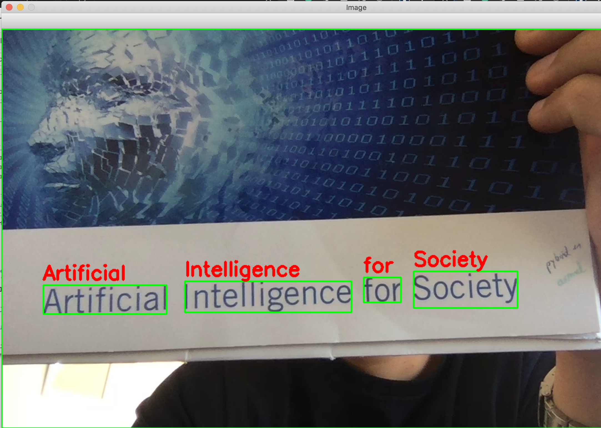

# Scane4Me

> Scane4Me is an open-source project for a smart wearable hardware module based on a RaspberryPi, that aims to help blind and visually impared people gain additional insights from the sorrounding environment. 

In this repository, you will find:
- `features`: a folder containing Jupyter Notebooks of individual features present in the module
- `images`: contains illustrations of the individual features
- `documentation.md`: a list of all documentations, resources and blogs used

Any contribution is more than welcome. If you work with visually impaired people, we would be more than happy to hear from you, build new features based on your feedback and deliver our hardware to your institution. Please reach out to me by [email](mailito:mael.fabien@epfl.ch).

## Features
 
### a. Live OCR
 
 A live OCR system built on top of OpenCV and Tesseract.
 
 

### b. Text to Speech

### c. Speech to Text

### d. Object detection

### e. Scene description

### f. Facial recognition

 