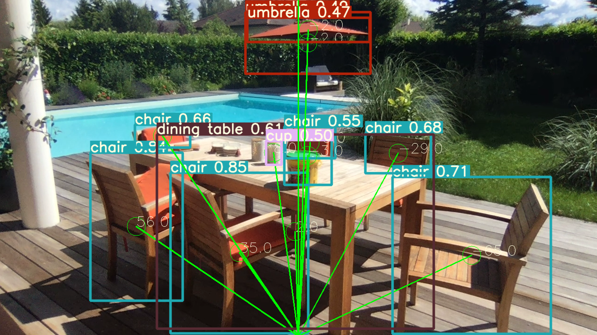

# Scane4Me

S-Cane4Me is a smart wearable device, strapped around the chest, and equipped with a camera, able to provide real-time information on the surrounding environment of a person through Audio Augmented Reality. Similarly to the way we easily identify the position of whistling birds, we aim to scan in real-time the surrounding environment and produce directional sounds (through audio AR) in the earphones connected to the device. End-users would, therefore, be able to map and understand their environment. A sketch of our first prototype is presented in Figure 1.


Currently, the technology locates objects, estimates their position, produces the sound accordingly, as presented in Figure 2. We rely on state-of-the-art object detection framework (YoloV5), are building our own sound AR-technology to help locate the object.



In this repository, you will find:
- `features`: a folder containing Jupyter Notebooks of individual features present in the module
- `images`: contains illustrations of the individual features
- `documentation.md`: a list of all documentations, resources and blogs used
- `src`: source code of the application

Any contribution is more than welcome. If you work with visually impaired people, we would be more than happy to hear from you, build new features based on your feedback and deliver our hardware to your institution. Please reach out to me by [email](mailito:mael.fabien@epfl.ch).

## Getting started

1. Install requirements:

```bash
pip install -r src/requirements.txt
```

2. Run the inference pipeline:

```bash
python src/cv.py
```

## Features

- Live object Detection using YoloV5
- Angle estimation between camera and object
- Producing sound based on type of object and angle in a 3D manner
- Live OCR (to be integrated)